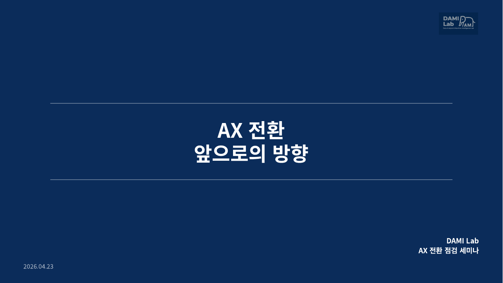
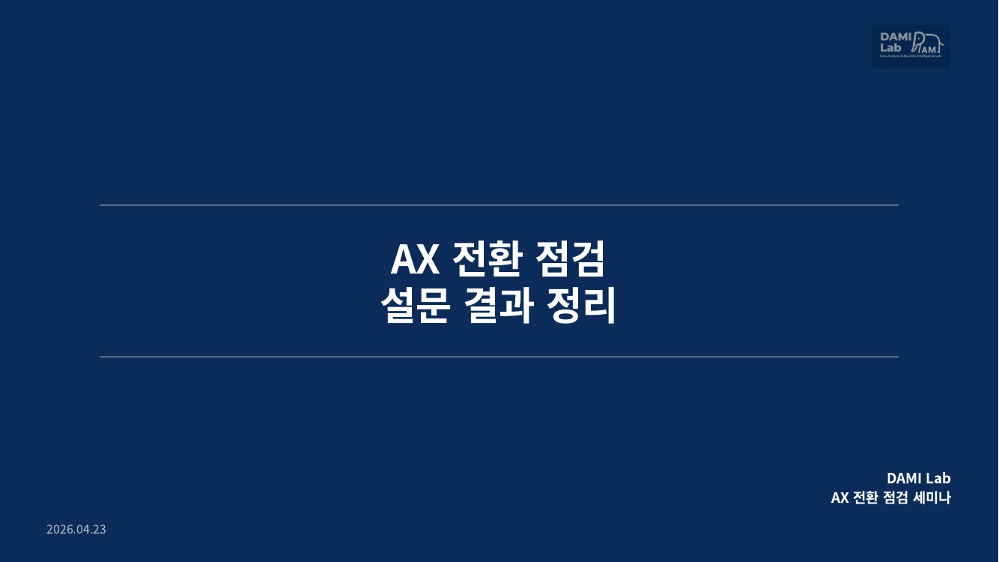
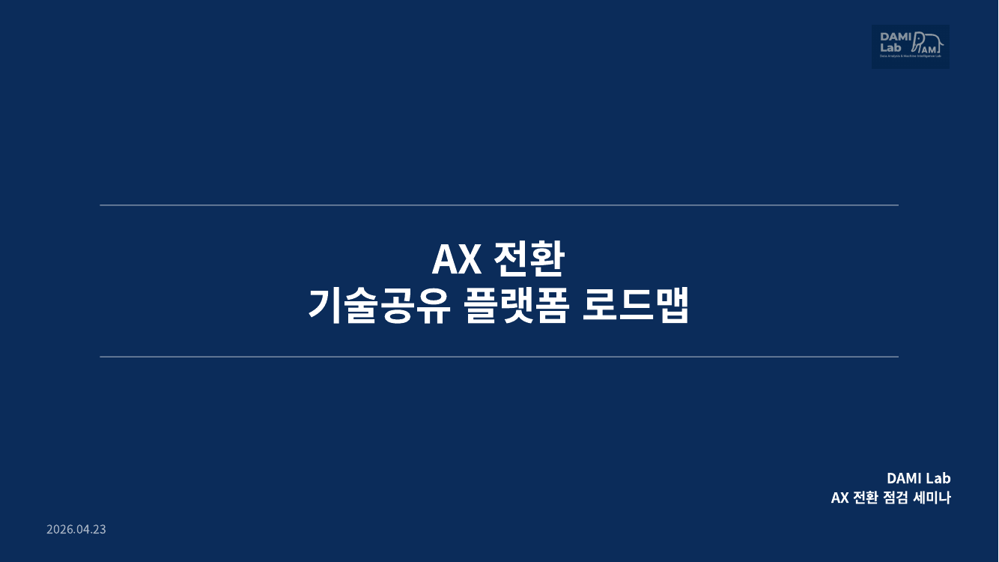
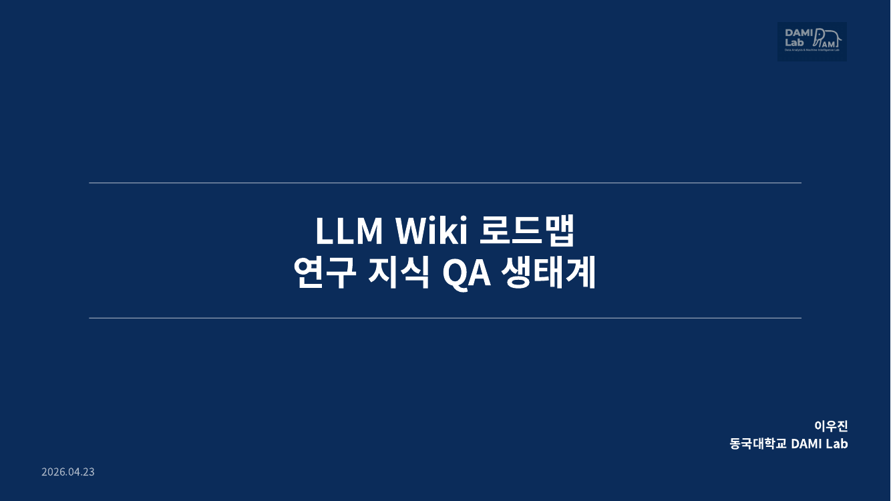
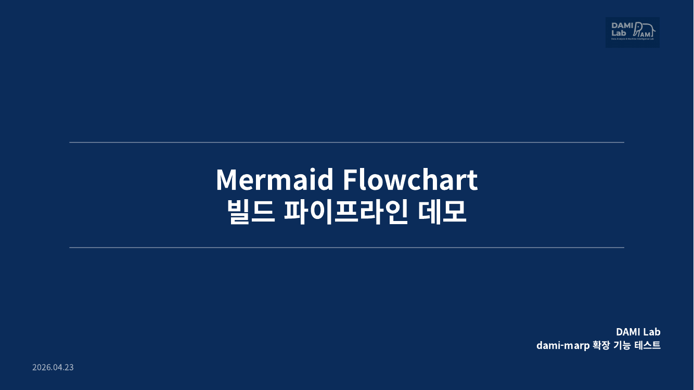

# dami-marp

> **DAMI Lab** 스타일 Marp 프리셋 — 동국대학교 컴퓨터·AI학과 DAMI Lab 에서 쓰는 PPT 양식을 Marp 로 구현한 테마 + 빌드 도구 + 작성 가이드.

마크다운 한 장으로 세미나·논문 발표 수준의 일관된 슬라이드를 뽑아낼 수 있게 설계했습니다. 네이비 `h1` border-left, `■ • – »` 4단 불릿 위계, 우상단 로고, 고정 푸터, 논문 인용 렌더러까지 포함.

<p align="center">
  
  
</p>
<p align="center">
  
  
</p>
<p align="center">
  
</p>

---

## 무엇이 들어있나

| 경로 | 역할 |
|---|---|
| [`themes/dami-lab.css`](themes/dami-lab.css) | 메인 테마 CSS (슬라이드 타입 5종 + 유틸리티 클래스) |
| [`bin/build.py`](bin/build.py) | 빌드 프리프로세서 — `{{cite:키}}` placeholder 치환 후 marp 실행 |
| [`assets/`](assets/) | DAMI Lab 로고 2종 (심플 / 풀) |
| [`refs.example.toml`](refs.example.toml) | 논문 인용 metadata 포맷 예시 |
| [`SKILL.md`](SKILL.md) | 슬라이드 작성 가이드 본문 (슬라이드 타입, 유틸리티, 인용 관리) |
| [`lessons.md`](lessons.md) | 테마를 만들며 겪은 버그/삽질 기록 (PDF 렌더 불안정, flanking, 세로 정렬 등) |
| [`patterns/`](patterns/) | 워크플로우 패턴 (예: 25장 넘는 큰 덱은 outline → chunk → subagent) |
| [`themes/mermaid-config.json`](themes/mermaid-config.json) | Mermaid flowchart 테마 (DAMI 네이비, Pretendard) |
| [`examples/`](examples/) | 실제로 빌드해서 쓴 5개 덱 — `md` + `pdf` + `assets` 세트 |

---

## 슬라이드 타입 5가지

| 클래스 | 용도 | 배경 | 로고 |
|---|---|---|---|
| `.title` | 표지 | 네이비 풀블리드 | 풀 로고 |
| `.toc` | 목차 | 흰색 | 심플 |
| `.section` | 섹션 전환 | 상단 63% 네이비 + 하단 37% 흰색 | 없음 |
| *(클래스 없음)* | 일반 본문 | 흰색 | 심플 |
| `.end` | Thank you | 흰색 | 심플 |

```markdown
<!-- _class: section -->

# 1. Introduction
```

한 줄로 타입을 지정하는 구조라, 본문엔 인라인 `<div style>` 없이 깔끔한 마크다운만 남습니다.

---

## 설치

### 1. Marp CLI + Mermaid CLI

```bash
# nvm 기반 권장
nvm install --lts
nvm use --lts
npm i -g @marp-team/marp-cli @mermaid-js/mermaid-cli
marp --version   # v4.x 확인
mmdc --version   # v11.x 확인 (mermaid flowchart 쓸 때만 필요)
```

> `mmdc` 는 ````mermaid```` 코드블럭을 쓰는 덱만 필요. 설치 안 해도 일반 덱은 빌드됨.

### 2. 한글 폰트 (Linux)

```bash
sudo apt install fonts-noto-cjk
```

### 3. 이 repo clone

```bash
git clone https://github.com/wj926/dami-marp.git
cd dami-marp
```

---

## Quick Start

가장 빠른 방법 — 예제 하나를 그대로 빌드해보기:

```bash
python3 bin/build.py examples/ax-forward-plan/ax-forward-plan.md
# → examples/ax-forward-plan/ax-forward-plan.pdf 생성
```

### 새 덱 만들기

1. `examples/` 아래에 새 폴더 만들고 logo 2개 복사
   ```bash
   mkdir -p my-deck/assets
   cp assets/dami_logo.png assets/dami_logo_full.png my-deck/assets/
   ```

2. `my-deck/my-deck.md` 작성, 맨 위에 **프론트매터** 복붙
   ```yaml
   ---
   marp: true
   theme: dami-lab
   paginate: true
   math: katex
   footer: '동국대학교 컴퓨터·AI학과 DAMI Lab'
   ---
   ```

3. 빌드
   ```bash
   python3 bin/build.py my-deck/my-deck.md                  # PDF
   python3 bin/build.py my-deck/my-deck.md --format pptx    # PPTX
   python3 bin/build.py my-deck/my-deck.md --format html    # HTML
   ```

자세한 문법·유틸리티·인용 관리는 [SKILL.md](SKILL.md) 참고.

---

## 예제 4개

각 폴더에 **마크다운 소스 + 완성 PDF + 첫 장 preview** 가 같이 들어있습니다. 그대로 빌드해보거나, 구조를 참고해서 새 덱을 만들 수 있습니다.

| 예제 | 주제 | 바로가기 |
|---|---|---|
| **ax-forward-plan** | AX 전환 앞으로의 방향 — 짧은 비전 공유 덱 | [md](examples/ax-forward-plan/ax-forward-plan.md) · [pdf](examples/ax-forward-plan/ax-forward-plan.pdf) |
| **ax-survey-results** | AX 전환 설문 결과 정리 — 차트 중심, `assets/charts/` 활용 | [md](examples/ax-survey-results/ax-survey-results.md) · [pdf](examples/ax-survey-results/ax-survey-results.pdf) |
| **skill-ecosystem-roadmap** | Claude Code 스킬 생태계 로드맵 — 26장 분량 중형 덱 | [md](examples/skill-ecosystem-roadmap/skill-ecosystem-roadmap.md) · [pdf](examples/skill-ecosystem-roadmap/skill-ecosystem-roadmap.pdf) |
| **llm-wiki-roadmap** | 연구 지식 QA 생태계 로드맵 — flow-row, callout, cols-2 종합 예시 | [md](examples/llm-wiki-roadmap/llm-wiki-roadmap.md) · [pdf](examples/llm-wiki-roadmap/llm-wiki-roadmap.pdf) |
| **mermaid-flowchart-demo** | Mermaid 통합 기능 데모 — 파이프라인 / 분기·합류 / 피드백 루프 3가지 패턴 | [md](examples/mermaid-flowchart-demo/mermaid-flowchart-demo.md) · [pdf](examples/mermaid-flowchart-demo/mermaid-flowchart-demo.pdf) |

---

## 설계 원칙

1. **CSS 는 레이아웃 프리셋 담당** — `.title`, `.toc`, `.section`, `.end` 같은 타입을 미리 만들어두고, 본문은 `<!-- _class: ... -->` 한 줄로 선택
2. **단일 진실 원천 (refs.toml)** — 같은 논문을 여러 슬라이드에서 인용해도 포맷이 자동으로 통일
3. **단색 배경만** — `linear-gradient` 는 PDF 렌더 엔진마다 해석이 달라서 사용 금지 ([lessons.md](lessons.md#linear-gradient-금지))
4. **Overflow 금지** — 본문 세로 가용 약 530px. 넘치면 내용 축약 or 슬라이드 분할
5. **본문에 따옴표 금지** — CommonMark flanking 이슈로 `**"..."**` 가 깨짐 ([lessons.md](lessons.md#쌍따옴표-금지))

---

## Claude Code 스킬로 쓰기

이 repo 는 [Claude Code](https://claude.com/claude-code) 의 user-level 스킬로 그대로 붙일 수 있게 설계돼 있습니다. `SKILL.md` 의 frontmatter 가 Claude 가 자동으로 읽는 스킬 manifest 역할을 합니다.

```bash
# user-level 스킬로 설치
git clone https://github.com/wj926/dami-marp.git ~/.claude/skills/marp

# Claude Code 에서 "이 주제로 marp 슬라이드 만들어줘" 라고 하면
# 자동으로 이 가이드를 따라 작성함
```

---

## 로드맵

### ✅ Recently shipped

- **Mermaid flowchart 통합** (2026-04-23) — `.flow-row` 로 부족했던 복잡한 topology (분기·합류·피드백 루프·트리) 를 ```mermaid``` 코드블럭으로 해결. `build.py` 가 `mmdc` 로 SVG 렌더 → DAMI 네이비 테마 적용 → data URI 로 슬라이드에 주입. 예제: [`mermaid-flowchart-demo`](examples/mermaid-flowchart-demo/). 알려진 이슈(라벨 끝 글자 clip)는 [lessons.md](lessons.md) 참고.

### 🟡 Medium priority

- **Mermaid label clipping 완전 해결** — 현재 한글/마침표/짧은 영문 라벨 끝이 1~2px clip. 회피 가이드는 있지만 근본 해결 필요. 방향: SVG 를 data URI 대신 `.svg` 파일로 저장 + `` 참조 (Chromium 의 독립 SVG rendering pipeline 경유).
- **유틸리티 패턴 문서 (`patterns/`)** — `cols-2.md`, `callout.md`, `flow-row.md` 개별 가이드. 현재는 예제 덱이 레퍼런스 역할을 하지만, 패턴 재사용이 늘면 전용 문서가 필요.
- **Pros/Cons · Before/After 양식** — `cols-2` 로도 되지만, 장점(초록 ✅) vs 단점(빨강 ✗) 같은 **대조 전용 클래스**가 있으면 연구 발표에서 자주 쓸 수 있음. `.pros-cons`, `.compare` 유틸리티 추가 예정.
- **부분 수정 워크플로우** — 덱 한 슬라이드만 고치고 싶을 때 전체 재처리가 아니라 surgical edit 하는 패턴. 슬라이드 번호 + 변경 지점 명시 → Edit 도구로 타겟 수정, 빌드는 필요한 시점에만.
- **빌드 파이프라인 문서** — `slides.md → refs.toml 치환 → .built.md → marp + --theme-set → PDF` 과정을 다이어그램 + 커스터마이징 포인트 설명으로. 디버깅·확장 시 필요.

### 🟢 Low priority

- **`overflow: hidden` pseudo-element 함정** — `.flow-box { overflow: hidden }` 이 `::before/::after` 화살표를 clip 해버린 사고. `lessons.md` 에 5~10줄 추가 예정.
- **본문 레이아웃 엔진 분리** — 지금은 "이쁘게"와 "본문 로직" 이 한 프롬프트에 섞여서 토큰을 크게 씀. 레이아웃 결정을 CSS 유틸리티 레벨로 위임하고, Claude 는 의미 단위만 고르도록 분리.
- **슬라이드 점검 프로세스** — 빌드 후 PDF 전수 체크 (overflow, 제목 Y좌표, 따옴표 잔존 등) 를 자동화. 한 번에 전부 맞히기보다 build → scan → fix 루프가 실용적.

### 🔮 Future ideas

- **수정 가능한 PPTX 출력 pipeline** — 현재 PPTX 는 marp 가 이미지로 슬라이드를 export. 외부 기관에서 PPT 원본 편집을 요청할 때를 위해 `python-pptx` 로의 변환 레이어 고려.

TODO 가 새로 생기면 Issue 로 올리거나 이 섹션에 추가.

---

## 구조

```
dami-marp/
├── README.md              # 이 문서
├── SKILL.md               # 슬라이드 작성 가이드 (Claude skill manifest 겸용)
├── lessons.md             # 빌드 버그 / 삽질 기록
├── refs.example.toml      # 논문 인용 metadata 예시
├── bin/
│   └── build.py              # 인용 치환 + mermaid SVG 렌더 + marp 빌드 래퍼
├── themes/
│   ├── dami-lab.css          # 메인 테마 CSS
│   └── mermaid-config.json   # Mermaid flowchart 테마 (네이비 + Pretendard)
├── assets/
│   ├── dami_logo.png         # 심플 로고 (일반 슬라이드 우상단)
│   └── dami_logo_full.png    # 풀 로고 (표지용)
├── patterns/
│   └── building-large-decks.md  # 25장 이상 덱 워크플로우
└── examples/
    ├── ax-forward-plan/
    ├── ax-survey-results/
    ├── skill-ecosystem-roadmap/
    ├── llm-wiki-roadmap/
    └── mermaid-flowchart-demo/
```

---

## 라이선스

MIT License — 자유롭게 fork, 수정, 재배포 가능. 다만 `assets/dami_logo*.png` 는 DAMI Lab 의 BI 이므로, 본인 조직 로고로 교체해서 쓰는 걸 권장합니다.

---

## Author

**이우진 (Woojin Lee)** · 동국대학교 컴퓨터·AI학과 DAMI Lab
