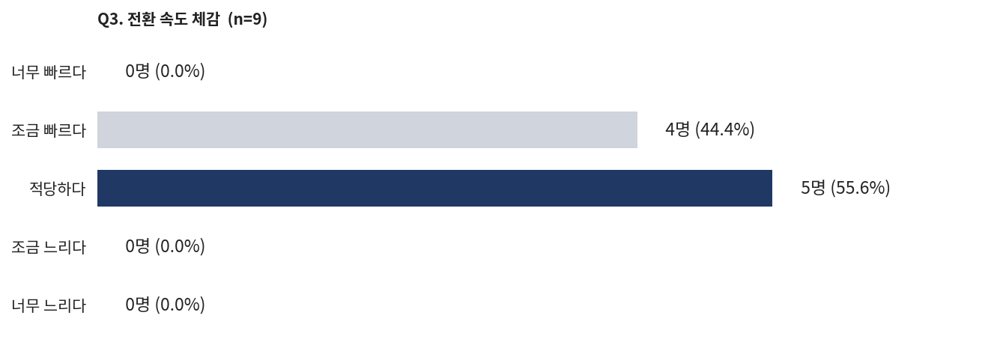
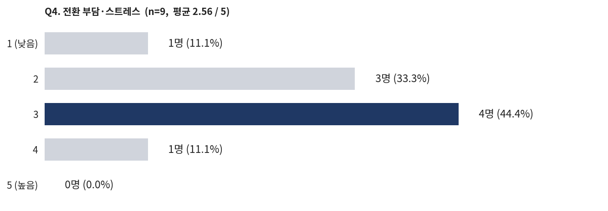
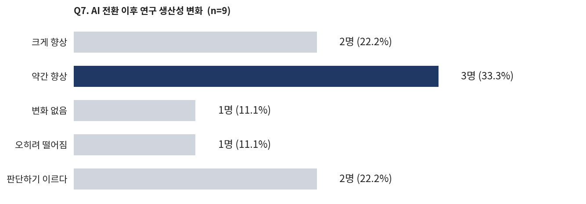
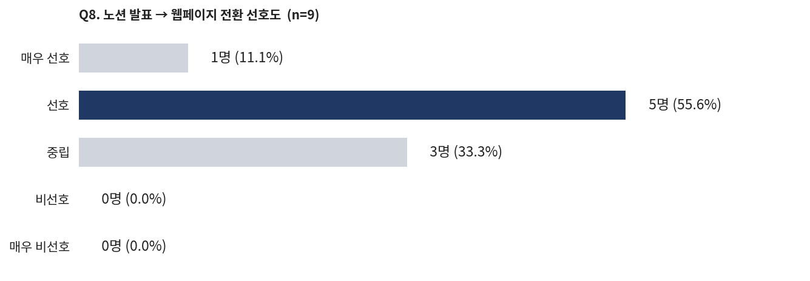
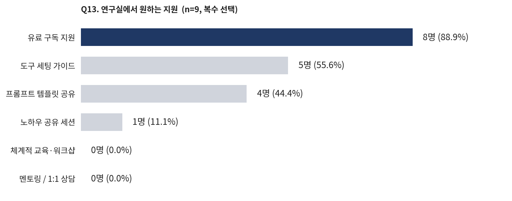

<!-- _class: title -->
<!-- _paginate: false -->

# AX 전환 점검 설문 결과 정리

DAMI Lab AX 전환 점검 세미나

2026.04.23

---

<!-- _class: toc -->

# Contents

1. 설문 개요
2. 전환에 대한 온도
3. AI 활용 현황
4. 10일간의 회고
5. 운영 방향 (미팅·플랫폼)
6. 지원 & 공통 개발
7. 교수님께 / 전체 종합

---

# 설문 개요

AX 전환을 시작한 지 **10일차** 시점에서 연구원 **9명**의 체감과 필요를 점검하기 위한 설문. 객관식(5점 척도·복수선택) **5문항** + 주관식 **11문항** 으로 구성되어, 속도·부담·생산성 같은 정량 축과 AI 활용 패턴·도움된 점·힘들었던 점·운영 방향 같은 정성 축을 함께 담았다.

|  |  |
|---|---|
| **수집일** | 2026-04-23 |
| **응답자** | 9명 (일부 문항 7~8명) |
| **문항 수** | 16문항 (객관식 5 / 주관식 11) |
| **목적** | 10일차 중간 점검 + 향후 방향 논의 근거 |

**이 덱의 활용**: 문항별 응답을 그대로 읽는 자리가 아니라, **패턴과 합의 지점**을 꺼내기 위한 재료. 주관식은 카테고리로 묶고, 수치는 bar chart 로 한눈에.

---

<!-- _class: section -->

# 1. 전환에 대한 온도

---

# Q3 + Q4. 속도와 부담은 괜찮은가?

**속도 체감**과 **스트레스 수준** 모두 "견딜 만함" 구간에 몰려 있다. **반대 의견(너무 빠르다 / 5점 부담)은 0명**, 하지만 **0 부담도 1명뿐**이라 '전원 편안함'은 아니다. 속도는 현재 수준을 유지하되, 개인 상황에 따라 속도를 조절할 여지를 열어두는 쪽이 안전해 보인다.

---

# Q7. 생산성은 실제로 올랐나?

**향상 체감이 5명(55.6%)** 으로 과반이지만, **판단 보류 2명 + 변화 없음/떨어짐 2명** 을 합치면 4명(44.4%)이 아직 확신을 못 하는 상태다. 도구 세팅·학습 비용이 초기에 몰려있어, 체감 생산성은 지금이 바닥이고 앞으로 상승 여지가 크다고 해석할 수 있다.

**해석**: 초기 학습 곡선 구간. **"판단 보류 22%" 를 2~3주 뒤 다시 점검**하면 실제 효과 추세를 볼 수 있을 것.

---

<!-- _class: section -->

# 2. AI 활용 현황

---

# Q1. 가장 많이 활용하는 연구 단계

응답 10건을 보면 **실험 설계·분석**과 **코드 작성·디버깅**이 가장 자주 등장한다. 논문 리서치·요약·작성은 거의 모든 응답에 포함되어 **공통 베이스라인**이 됐고, 제안서·미팅 자료 같은 행정 글쓰기는 일부 인원에게서 강한 효용이 보인다.

코드·디버깅 실험 코드 작성, 오류 해결, 코드 분석·수정 (4건)

실험 설계·분석 실험 방향 보완·구조화, 결과 분석, 개선 방향 제시 (4건)

논문 리서치, 요약, 번역, 리딩 (5건)

행정·기타 제안서, 미팅 자료, reference 찾기, 시각화 (3건)

**한 응답 발췌**: "아이디어 발굴을 **제외한 전 단계**에서 사용". 즉 AI 가 이미 연구 파이프라인의 기본 도구로 자리 잡음.

---

# Q2. AI 활용에서 어렵거나 잘 안 되는 부분

응답을 네 덩어리로 묶으면: **맥락 유지**, **정보 과다**, **하네스·스킬 설계**, **리소스 제약**. 이 중 '**하네스·스킬 설계**' 가 가장 많이 언급돼 (5건) 연구실 차원의 가이드가 가장 큰 레버가 될 지점으로 보인다.

맥락 유지 프로젝트 단위로 이전·현재·다음 작업을 연결해 쓰는 것이 미숙 / 중간 확인 질문을 놓치면 엉뚱한 방향으로 감

정보 과다 신규 스킬·툴 업데이트 속도를 따라가기 어려움 · 정보량 자체가 너무 많음

하네스·스킬 설계 md 구조·하네스 설계가 원하는 대로 안 됨 / 스킬 구성 기준 불명확 / 하네스를 어디까지 세팅해야 하는지 / 자동화의 필요성 자체가 아직 체감 안 됨

리소스 토큰 한계 · 서버에서 다른 사용자와 스킬 충돌 · 시각화 능력 부족

---

# Q11. AI 가 가장 절실히 필요한 지점

Q1 이 '어디에 많이 쓰나' 라면, Q11 은 '어디가 제일 아쉽나'. **실험 전 과정 자동화**와 **논문 리서치·정리**가 가장 자주 나왔고, "**코드·데이터를 내가 일일이 안 봐도 되게**" 라는 원론적 바람이 등장한다. AX 전환의 방향성과 정확히 일치.

실험 자동화 실험 설계·수정·구체화·구현·분석까지의 **전체 파이프라인**: "가장 환각 없이 AI 를 쓸 수 있는 부분" (3건)

논문 리서치, 작성, 정리, 결과 해석, reference 발굴 (4건)

아이디어·발상 기존 연구의 취약점 캐치 + 아이디어 빠른 구현 (1건)

행정 자동화 미팅 자료 생성, 코드·데이터 이해 없이 작업하기 (2건)

---

<!-- _class: section -->

# 3. 10일간의 회고

---

# Q5 + Q6. 가장 도움된 것 vs 가장 힘들었던 것

대칭으로 놓고 보면, **도움된 것**은 대부분 **개별 효율** 영역(코드·논문·미팅 자료 자동화)에 있고, **힘들었던 것**은 대부분 **집단 운영** 영역(학습 부담, 신규 정보 추적, 부담 불균형)에 있다. 전환의 개인 레벨 이득은 이미 나오고 있고, 다음 과제는 집단 레벨 설계라는 신호.

### 도움된 것

자동화 효용 디버깅·논문 조사 자동화로 **집중해야 할 부분에 집중** 가능해짐 · 연구에 탄력

리서치·글쓰기 논문 리서치·요약, 논문 포매팅, 제안서·미팅 자료 작성

외부 공유 Claude Max / superpower / ouroboros 같은 플러그인·세팅 공유

### 힘들었던 것

학습 곡선 "**어디서부터 시작해야 할지 모르겠다**" · 스킬·하네스 적용법 불명확

정보 과다 새 스킬·git 변경이 빠르게 올라와 따라가기 바쁨

부담 불균형 덜 바쁜 사람이 책임을 떠안는 구조 · 민석 리더 부담 언급

리소스·기대치 토큰 부족, Codex 막힘 · 기대치 상승에 따른 압박

---

<!-- _class: section -->

# 4. 운영 방향 (미팅·플랫폼)

---

# Q8 + Q9. 노션 → 웹페이지 전환

**선호 이상 6명(66.7%), 비선호 0명**. 방향에는 합의가 있지만, "**완성도**" 를 단서로 다는 응답이 다수라 성급한 전면 교체보다는 **병행 단계**를 거치는 쪽이 안전해 보인다.

"전환 자체는 선호. 다만 **아직은 웹페이지가 좀 더 다듬어져야** 할 듯"

"노션 정리에 시간 소모가 커서 **웹페이지에 자동화 형태**로 작성하는 게 더 좋을 것 같음"

"시각적으로 보여줘야 하는 실험 결과에는 **html 이 더 적합**. md 로 주고받는 것도 좋음"

---

# Q12. AX 회의는 필요한가

7명이 응답, **대체로 필요 쪽**. 단 키워드는 "**가벼운 공유**" 와 "**파이프라인 소개**" 이고, 공식 세미나 형식보다는 **짧은 주간 공유**가 더 맞는다는 신호다.

"기존 논문 세미나보다는 **AX 회의가 더 도움**이 될 것 같음"

"**주 1회** 정도, '나는 이걸 발견했는데 잘된다' 정도의 간단한 설명"

"각자 자기 연구에 **agent 를 어떻게 쓰고 있는지, 파이프라인을 소개**하는 시간. 옆 동료를 보며 '나도 저렇게 써봐야지' 하도록"

"거창한 회의로 진행하기에는 부담" · "슬랙이나 홈페이지가 정돈되면 그쪽을 쓰는 게 낫지 않을까"

---

<!-- _class: section -->

# 5. 지원 & 공통 개발

---

# Q13. 연구실이 제공해주면 좋을 지원

**유료 구독(89%)이 압도적 1순위**, 다음은 **도구 세팅 가이드(56%)** 와 **프롬프트 템플릿 공유(44%)**. 반면 **공식 교육·멘토링 수요는 0명**. 연구원들은 '**재료를 주면 알아서 익힌다**' 는 쪽의 자율 학습형 분포를 보인다.

**함의**: 예산은 **구독료 + 가이드 문서 제작**에 집중. 체계적 워크샵/멘토링 같은 **풀커리큘럼은 비용 대비 효용이 낮음**.

---

# Q14 + Q10. 함께 개발할 도구 & 웹페이지 기능

자유 제시 응답에서 **가장 반복된 항목은 '일일 리포트 자동화' 와 '논문 관련 자동화'**. 웹페이지 기능에서도 '논문 검색·요약', '토큰 사용 추적' 같은 **연구실 전체가 공통으로 쓸 것**이 먼저 언급된다.

### Q14. 공통 개발 도구

일일 리포트 실험 로그 → 일일 리포트 자동화 (3건)

논문 자동화 리뷰·서치·포매팅 에이전트 · 학회별 양식 자동 점검

행정 봇 제안서 봇, 리포트 봇

통합 플랫폼 홈페이지에 모든 도구 연동 · 연구 주제별 좋은 스킬 큐레이션

### Q10. 웹페이지 관리 기능

공통 기능 논문 검색·요약 (공통 베이스) · 보안 (API·계정)

내부 운영 질문·정보 공유용 내부 커뮤니케이션 · 학회 양식 정리

리소스 모니터 실시간 서버 사용 관리 · 토큰 사용 추적

개인화 사용자별 내부 폴더 · 제안서·보고서 봇의 **지속적 관리**

---

<!-- _class: section -->

# 6. 교수님께 / 전체 종합

---

# Q15 + Q16. 교수님께 전하는 메시지

**방향성에는 전반적 동의**. 단, 단서가 세 개 붙는다: **학회 논문 일정**, **일부 인원 부담 집중**, **프레임워크 강요보다 개인별 하네스 + 공유 스킬**. 그리고 감사·응원의 메시지도 함께.

"**단기적으로는 전환 속도가 낮을 수밖에 없음** (학회 타겟 논문 진행 중). 장기적으로는 방향이 올바르다고 생각"

"**5월 말 논문 목표** 팀들이 있어서, 느리더라도 지금은 **천천히 바꿔가는 게** 좋아 보임"

"꼭 모두가 **똑같은 프레임워크**로 하지 않아도 됨. 개인별 하네스 + **skill 형태로 필요할 때 남의 툴을 불러오기** (superpower 처럼)"

"연구원 간 **클로드코드 이해도 차이**가 효율 차이로 이어지는 인상"

"**일부 사람 주도만으로 전체 AX 를 진행하기에는 부담**이 커 보임 · 민석이가 힘들어 보여요 ㅠㅠ"

"항상 신경 써주셔서 감사합니다. 방향은 너무 좋고, 나중에는 다 저희한테 도움될 것"

---

# 전체 종합: 7가지 키메시지

1.<b>온도는 '견딜 만함'</b>: 속도·부담 모두 반대 의견 0명, 다만 완전 편안함도 소수. 현 수준 유지.

2.<b>생산성 체감 과반</b>: 향상 56%, 판단 보류 22%. 2~3주 뒤 재점검 권장.

3.<b>개인 효용은 이미 발생</b>: 코드·논문·미팅 자료 자동화에서 명확한 이득.

4.<b>다음 과제는 집단 설계</b>: 학습 곡선, 정보 과다, 부담 불균형은 개인이 풀 수 없는 문제.

5.<b>지원 우선순위</b>: <b>유료 구독 89% + 가이드 문서</b>. 공식 교육/멘토링은 선호 0.

6.<b>공통 개발 1순위</b>: 일일 리포트 자동화, 논문 리뷰·서치 자동화. 통합 플랫폼은 장기.

7.<b>운영 방향</b>: 노션→웹페이지 전환은 OK(완성도 관건), AX 회의는 <b>가벼운 주간 공유</b> 선호. 개인별 하네스 + 공유 스킬.

---

<!-- _class: end -->

# Thank you
