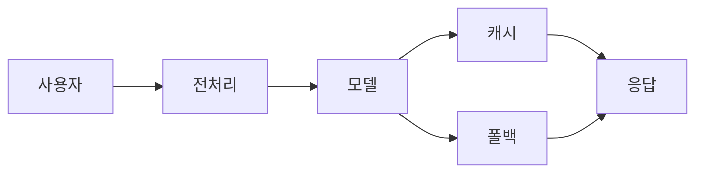
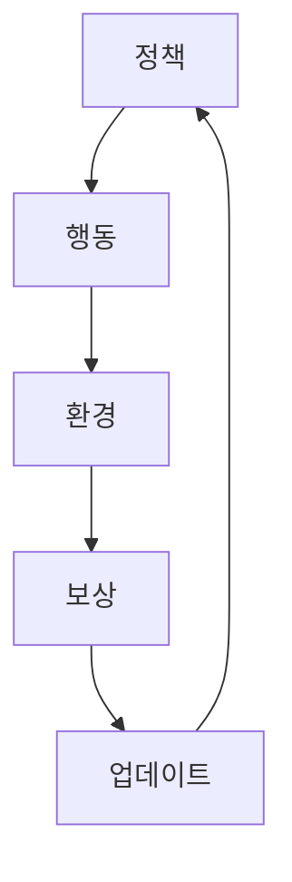

<!-- _class: title -->
<!-- _paginate: false -->

# Mermaid Flowchart<br>빌드 파이프라인 데모

<div class="author">DAMI Lab<br>dami-marp 확장 기능 테스트</div>
<div class="date">2026.04.23</div>

---

<!-- _class: toc -->

# Contents

1. 개요
   - Mermaid 통합 이유
   - 빌드 파이프라인
2. 예시
   - 선형 파이프라인
   - 분기와 합류
   - 피드백 루프

---

# 개요

## 목적

- Marp 덱에 **벡터 다이어그램**을 마크다운 한 블록으로 삽입
- CSS `.flow-row` 는 가로 1줄만, 대각선/분기/루프는 표현 불가
- Mermaid flowchart 를 빌드 타임에 SVG 로 치환해서 PDF 에 직접 박음

## 지원 범위

- **flowchart LR** (가로 흐름) / **flowchart TD** (세로 흐름)
- Mermaid 표준 문법 그대로 (노드, 엣지, 라벨, 서브그래프 등)
- DAMI 테마 컬러(네이비 #0b2c5a) 로 자동 튜닝

<div class="callout-r">

<b>한 줄 요약</b> — <code>```mermaid ... ```</code> 블록을 쓰면 SVG 로 치환됨. 추가 설정 불필요.

</div>

---

# 빌드 파이프라인

## 단계

- `build.py` 가 슬라이드 파싱 시 mermaid 블록을 추출
- `mmdc` CLI 로 각 블록을 SVG 렌더
- 원본 코드블록 위치에 inline SVG 주입 후 marp 실행

## 이 슬라이드가 그걸 보여주는 live 예시


---

# 예시 1: 선형 파이프라인

## 사용자 요청 처리 흐름

- 입력이 모델까지 가는 단순한 선형 구조
- `.flow-row` 로도 표현 가능하지만 Mermaid 가 더 유연


---

# 예시 2: 분기와 합류

## 캐시 + 폴백 경로가 합류

- 선형 흐름으로는 표현 불가
- 같은 노드로 여러 경로가 수렴하는 패턴을 자연스럽게 그림



---

# 예시 3: 피드백 루프

## 학습 루프 구조

- 출력이 다시 입력으로 돌아오는 사이클
- 에이전트/자가개선/RL 파이프라인에서 자주 나옴



---

<!-- _class: end -->

# Thank you
